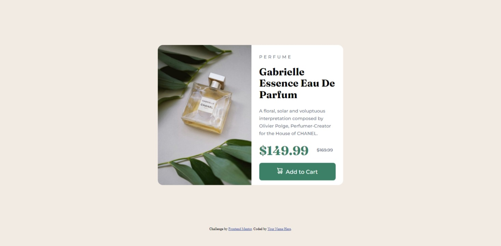

## Table of contents

- [Overview](#overview)
  - [The challenge](#the-challenge)
  - [Screenshot](#screenshot)
  - [Links](#links)
- [My process](#my-process)
  - [Built with](#built-with)
  - [Continued development](#continued-development)
  - [Useful resources](#useful-resources)
- [Author](#author)

## Overview

### The challenge

Users should be able to:

- View the optimal layout depending on their device's screen size

### Screenshot

### Links

- Solution URL: [Github](https://github.com/AlejandroLR00/Product-preview-card-component)
- Live Site URL: [Live site](https://idyllic-melomakarona-6b4f3d.netlify.app/)

## My process

### Built with

- Mobile-first workflow
- HTML
- CSS

### Continued development

I would like to improve my css code, learn more about css (flexbox, grid, etc.) and better structure the html

### Useful resources

- See projects on gihub
- Internet forums

## Author

- Frontend Mentor - [@AlejandroLR00](https://www.frontendmentor.io/profile/AlejandroLR00)